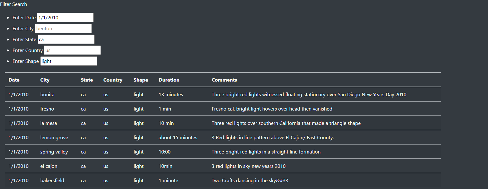

# UFOs

## Overview of Project
The purpose of this project was to format a webpage (html file) to look display UFO sightings from a JSON fileand make it look presentable.
Additionally, we added four additonal filters from the original date filters. Those four were city, state, country, and shape. In the app.js
file we created two functions to be able to do this.

## Results
To perform a search, you would just enter the required information and then press enter for each filter desired. For example, here is a
filter based on a date of '1/1/2010', the state being 'ca', and the shape being 'light':

## Summary

### One Drawback
One noticeable drawback of this webpage is that to refresh the filter, you must hit refresh on the browser. This makes it kind of tedious
to look at multiple filters.

### Addtional Recommendations
One recommendation I have is to have an autofill function when you are typing out a filter. This way, there are no typos and you are filtering
based on values that are already in the data. A second recommendation I have is to have a button to refresh the filters. Like I stated
earlier, the only way to refresh the filter is to refresh the browser. Having a button to do that makes things much easier.
